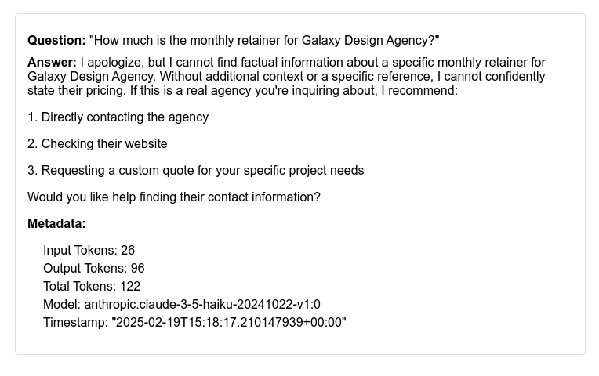

# ragtime

## Why this Project?

I wanted to start putting together a portfolio of public showcase/demo projects in various domains and I was inspired by the Python project [deploy-rag-to-aws](https://github.com/pixegami/deploy-rag-to-aws) by [pixegami](https://github.com/pixegami). His project is intuitive, well-designed, and puts together an advanced use of AWS Lambda functions to call Amazon Bedrock LLMs to answer questions tailored to information only present in local PDF files.  

This project aims to re-implement the RAG architecture project but using the Rust language.

## Why Rust?

When using AWS and other cloud services, eventually recurring costs add up.  Because Rust compiles down to memory-efficient binaries and is known for it's speed compared to Python, faster, less memory-intensive Lambdas translate into greater performance and cost savings.

Even the author of the Oreilly book [Python for Devops](https://pythondevops.com/) recently wrote [Why I Like Rust Better Than Python](https://podcast.paiml.com/episodes/why-i-like-rust-better-than-python) which advocates for why Rust is an attractive choice over Python.

The polemnic why Rust is more efficient than Python at a high level, amounts to:

1. **Compiled vs. Interpreted**: Rust is a compiled language, producing optimized machine code, whereas Python is interpreted, which adds overhead during runtime.
2. **Memory Management**: Rust uses manual memory management with ownership, borrowing, and lifetimes, which avoids garbage collection and reduces runtime memory overhead.
3. **Concurrency**: Rust's ownership system ensures safe and efficient concurrency without race conditions, while Python's Global Interpreter Lock (GIL) limits multithreading performance.
4. **Low-Level Access**: Rust provides low-level control over hardware and memory, allowing better optimization for performance-critical tasks.
5. **Zero-Cost Abstractions**: Rust’s abstractions do not introduce performance penalties, unlike Python, which can incur overhead with higher-level constructs.

## What is RAG?

[Retrieval Augmented Generation](https://en.wikipedia.org/wiki/Retrieval-augmented_generation) (RAG) is a way of leveraging Supervised [Fine-Tuning](https://en.wikipedia.org/wiki/Fine-tuning_(deep_learning)) (SFT) 

The idea is that we can use a pre-trained LLM but fine-tune it so it can answer questions from ancillary material.

In our case, you can put PDF files in `pdfs` directory at the same level as the `src` directory, and those PDF files will be read, processed and chunked such that embeddings can be created. The embeddings will then be loaded in to a vector database capable of assessing similarity. This is a bit tricky because an AWS lambda is serverless and only has a writable `/tmp` directory at runtime.  We leverage an S3 bucket to store the embeddings from the PDFs and download it for use by the lambda.

When a user submits a question, embeddings for the question are created in the same manner as for the PDF files, and compared for similarity.  Similar records are retrieved and add to the prompt that includes the question for submission to the Large Language Model.

RAG is akin to the concept of "leading the witness".

To illustrate, here is a question the LLM was not trained on and cannot possibly know the answer.

Here would be the answer if we inserted context containing the answer into the prompt:

And here is the answer with Retrieval Augmented Generation (RAG):
TODO!

## Components

### AWS

 - [Amazon Lambda](https://aws.amazon.com/lambda/)
 - [Amazon Bedrock](https://aws.amazon.com/bedrock/)
 - [Amazon S3](https://aws.amazon.com/s3/)

### Rust Ecosystem

 - [crates.io](https://crates.io)
 - [cargo](https://doc.rust-lang.org/cargo/)
 - [cargo lambda](https://www.cargo-lambda.info/)

## Installation and Running the programs

### `vectordb_stuff`

### `lambda_stuff`

