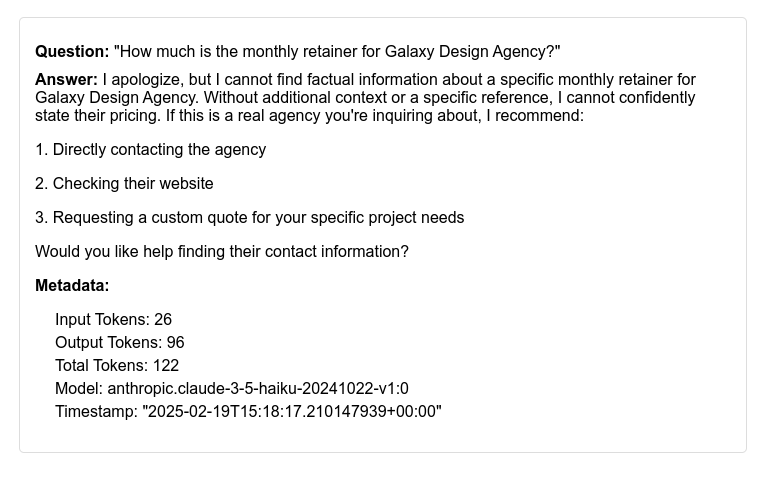
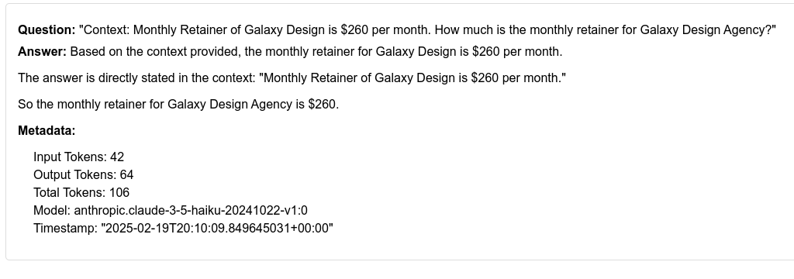

# What is RAG?

[Retrieval Augmented Generation](https://en.wikipedia.org/wiki/Retrieval-augmented_generation) (RAG) is a way of leveraging Supervised [Fine-Tuning](https://en.wikipedia.org/wiki/Fine-tuning_(deep_learning)) (SFT)

The idea is that we can use a pre-trained LLM but fine-tune it so it can answer questions from ancillary material.

In our case, you can put PDF files in the `vector_db/pdfs` directory, and those PDF files will be read, processed and chunked such that embeddings can be created. The embeddings will then be loaded in to a vector database capable of assessing similarity. This is a bit tricky because an AWS lambda is serverless and only has a writable `/tmp` directory at runtime.  We leverage an S3 bucket to store the embeddings from the PDFs and download it for use by the lambda.

When a user submits a question, embeddings for the question are created in the same manner as for the PDF files, and compared for similarity.  Similar records are retrieved and add to the prompt that includes the question for submission to the Large Language Model.

RAG is akin to the concept of "leading the witness" via adding context to a question.

To illustrate, here is a question the LLM was not trained on and cannot possibly know the answer.  The LLM apologizes that it doesn't know the answer (though it is remarkable that it doesn't give a false, hallucinated response).

If we insert context containing the answer into the prompt, the same LLM is able to answer correctly. 

